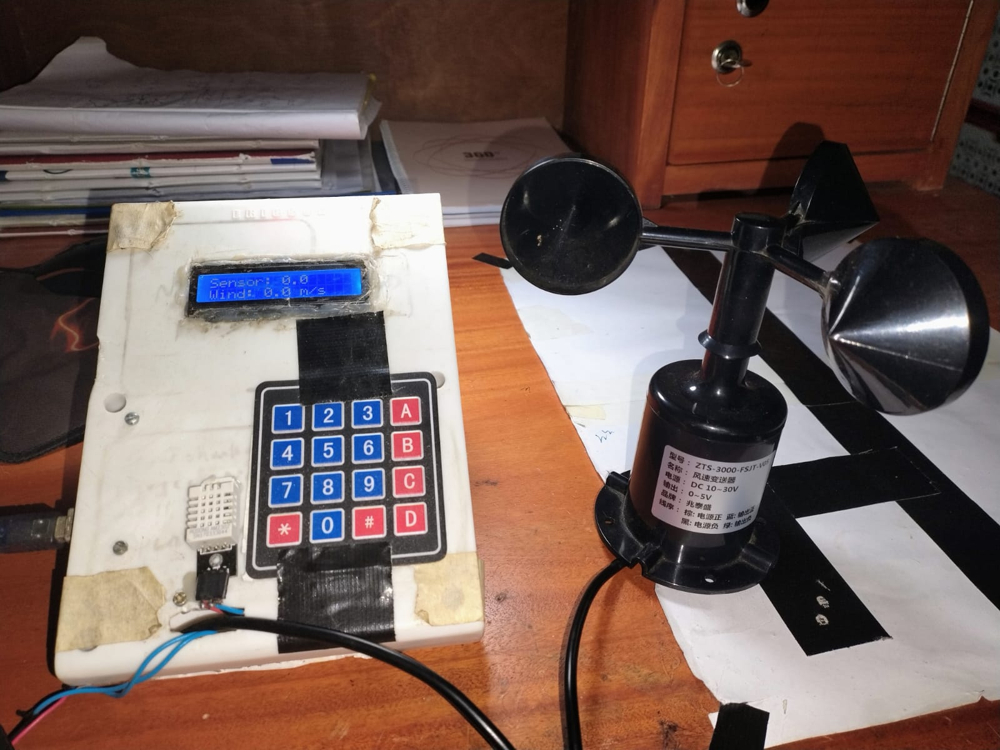
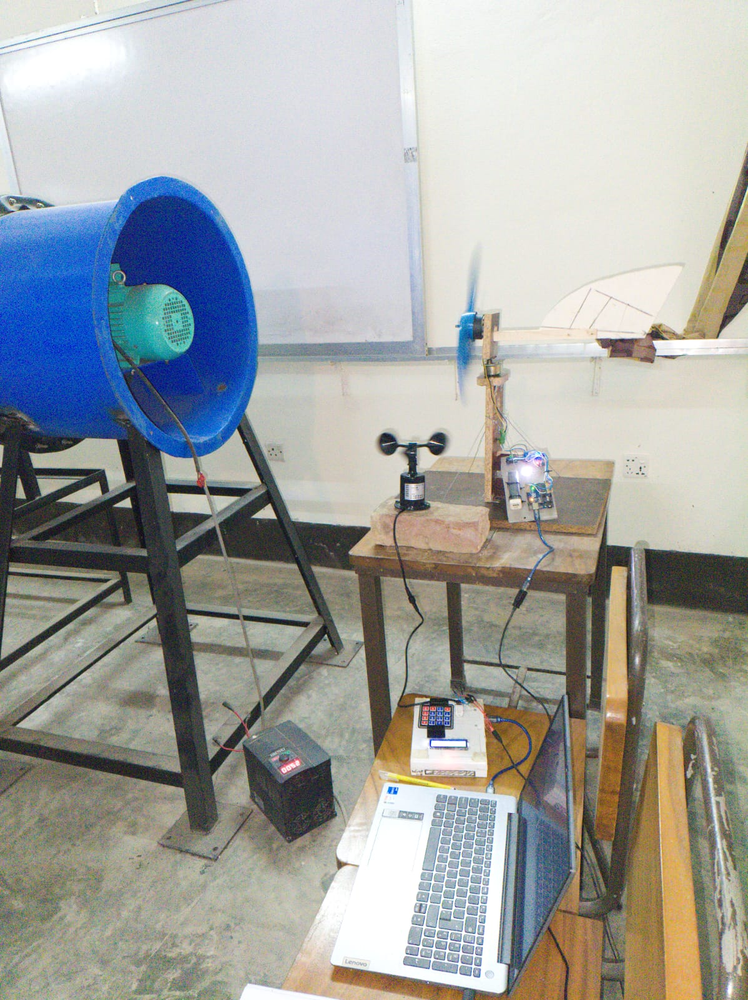

# Wind & Weather Data Logger

This project is a wind and weather data logger using a cup anemometer, SD card module, DHT sensor, key matrix, and an LCD display. It records wind velocity, temperature, and humidity data to an SD card with configurable filename and sampling interval using the key matrix.

## Features
- Measures wind velocity using a cup anemometer
- Records temperature and humidity using a DHT sensor
- Stores data on an SD card
- Configurable filename and sample interval via key matrix
- LCD display for real-time data and settings

## Components Used
- **Cup Anemometer** – Measures wind speed
- **DHT Sensor** – Captures temperature and humidity data
- **SD Card Module** – Stores recorded data
- **Key Matrix** – Sets filename and sampling interval
- **LCD Display** – Shows real-time readings and settings
- **Microcontroller (e.g., Arduino)** – Manages data collection and storage

## Setup & Usage
1. **Connect Components**: Wire the anemometer, DHT sensor, SD card module, key matrix, and LCD display to the microcontroller.
2. **Upload Code**: Flash the microcontroller with the provided Arduino code.
3. **Power Up**: Connect the system to a power source.
4. **Set Filename & Interval**: Use the key matrix to define the filename and sampling interval.
5. **Start Logging**: The system will begin recording wind speed, temperature, and humidity data to the SD card.
6. **Retrieve Data**: Remove the SD card and access the recorded files on a computer.

## Data Format
The recorded data is stored in a CSV format:
```
Timestamp, Wind Speed (m/s), Temperature (°C), Humidity (%)
2025-01-29 12:00:00, 5.4, 22.3, 55
2025-01-29 12:01:00, 6.1, 22.4, 54
```

## Dependencies
Ensure the following Arduino libraries are installed:
- `DHT.h` (for temperature & humidity sensor)
- `SD.h` (for SD card module)
- `LiquidCrystal.h` (for LCD display)
- `Keypad.h` (for key matrix input)

---

### 📷 Data Logger Project Photos

  


---

## Future Improvements
- Add data transmission via WiFi/Bluetooth
- Implement graphical data visualization on LCD
- Improve power efficiency for long-term deployment

## License
This project is open-source.

## Author
Simul Ahmed

